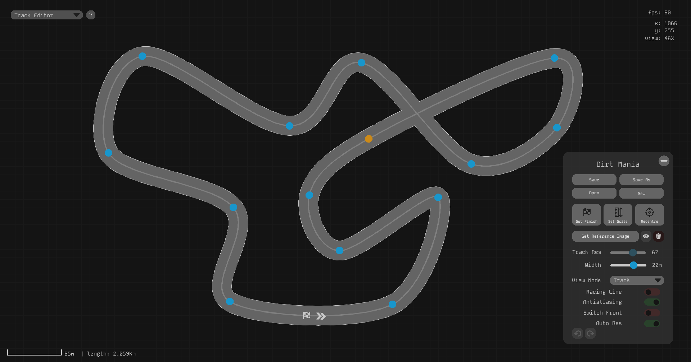
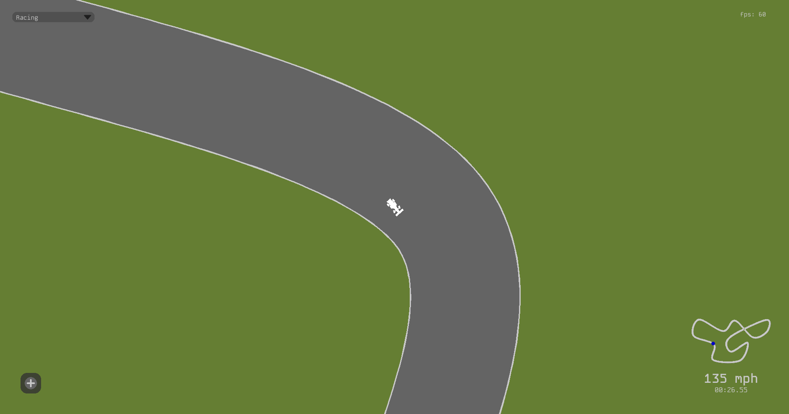

# Spline Racer
A game that allows you to design the track of your dreams, set the fastest lap, and share it with friends.

## Setup (from source code):
This project requires you to have python installed (versions **before 3.11 may work**, but have not been tested)

1. Download the project [here](https://github.com/Raphael-W/Spline-Racer/archive/refs/heads/main.zip) (or use the green 'code' button above)

2. Run `setup.py` to install required libraries

3. Run `src/main.pyw` or the `Spline Racer` shortcut

## Setup (from release build):
Currently, the build is only available for Windows.

1. Download the latest release, and unzip it

2. Run `Spline Race.exe`

**NOTE:** All tracks are stored in the `tracks/` folder. Removing a track from this folder will **permanently delete** its race times.
